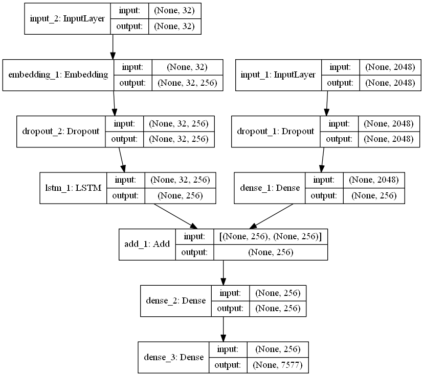

# Image Caption Descriptor for Visually Impaired

This project, developed for the Smart India Hackathon, is an image captioning system designed for deployment on edge devices to assist visually impaired users. The system captures the scene in front of the user, generates a descriptive caption, and provides audio output.

## Overview

The program uses a CNN-LSTM model:
- **CNN (Xception)**: Extracts features from the input image.
- **LSTM**: Processes these features to generate a coherent caption based on the context of the image.

This combined approach enables accurate and context-aware descriptions that can be read out loud, enhancing accessibility for visually impaired users.



## Features
- **Image Capture**: Captures images using a connected camera (webcam).
- **Feature Extraction**: Uses Xception model for extracting features from the captured image.
- **Caption Generation**: Generates descriptive captions using a CNN-LSTM model.
- **Text-to-Speech**: Converts the generated captions to audio for accessible feedback.

## Requirements
- Python 3.x
- Keras
- TensorFlow
- OpenCV
- Pyttsx3
- NumPy
- PIL (Pillow)

## Setup

1. **Clone the Repository**
    ```bash
    git clone <repository-url>
    cd <repository-directory>
    ```

2. **Install Dependencies**
    ```bash
    pip install -r requirements.txt
    ```

3. **Download Pre-Trained Models**
   - Place the `model_9.h5` and `tokenizer.p` files in the `models` directory.

## Usage

1. **Run the Program**
    ```bash
    python caption_descriptor.py --image <path-to-image>
    ```

   - Alternatively, if no image path is provided, the program will initiate the camera to capture a live scene.

2. **Keyboard Controls for Live Mode**
   - Press `s` to capture the current frame and generate a caption.
   - Press `q` to quit the program.

## Code Overview

- **extract_features**: Extracts features from an input image using the Xception model.
- **generate_desc**: Generates a caption by iterating through predicted words from the LSTM language model.
- **pyttsx3 Integration**: Uses pyttsx3 for reading captions aloud.

## License
This project is licensed under the MIT License. See the LICENSE file for details.

## Contributing
Contributions are welcome! Please fork the repository and submit a pull request for any enhancements.

---

This README.md now includes a brief explanation of the CNN-LSTM model and includes the architecture image for a more comprehensive understanding of the project.
